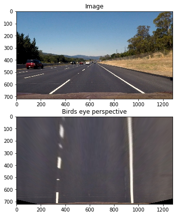

Lane detection algo:

1.Undistort img:

We use pictures of cheesboard to create a undistort function to use on our images of roads

Chessboard is used because opencv has a very convienient function called findChessboardCorners

First we create a list of chessboard images and use their corners to undistort the image
cv2.findChessboardCorners

cv2.calibrateCamera

cv2.undistort

2.To get binary image as output:

A threshold binary image contains a representation of the original image but in binary

To retain the colour while doing the transformation we will use HSL transform and then choose S and L channel 

We apply sobel filters to identify the lane

In the end combination of both Sobel filters and S, L channels gave a good result.

3.Lane Line Identification:

We plot a histogram for the brightness of the lower part of the birds eye image.

The peaks give us the pixel position of lanes identified at the lower side of the image. With this, we fit a second-order polynomial to fit the lane line. Using the same we create several windows and move up in an image to identify the full lane lines in an image(Sliding window technique).

Sliding windows:
A curving lane can be imagined as a number of sliding windows on top of each other

    

     

    

  
4. Sanity check:
Checks if left and right fits exist
Calculates the tangent between left and right in two points, and check if it is in a reasonable threshold

5. Draw and output:
We use cv2.polyfill function to draw on the image where the lanes have been detected and output

                                            
Output looks as such:
                                            

    

  
                                                    

    

                                                    

                                            
                                            
                                                                                                       

